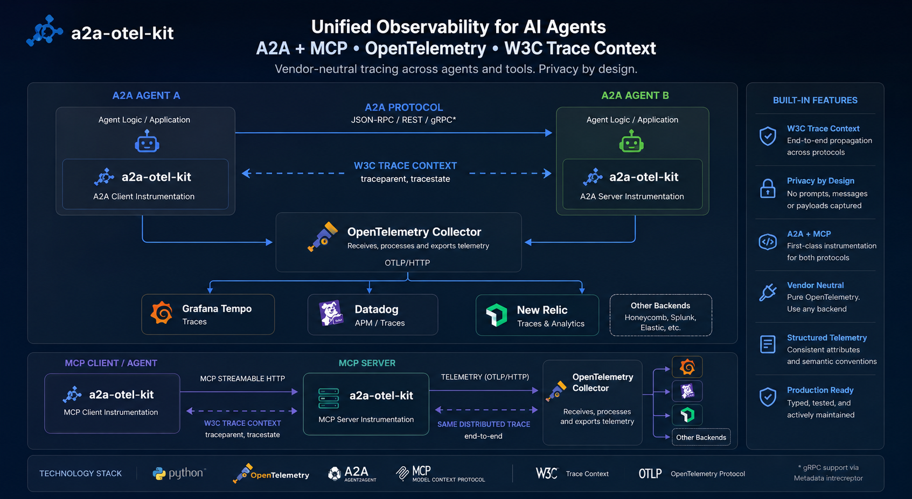
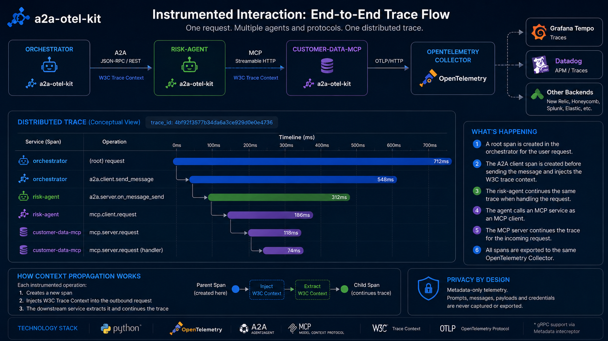

# a2a-otel-kit

[Português (Brasil)](README.pt-BR.md)

> **Vendor-neutral distributed tracing for A2A agents and MCP services.**

Connect agent-to-agent and MCP calls into a single OpenTelemetry trace using W3C Trace Context - without capturing prompts, messages, credentials, or business payloads.

[](https://pypi.org/project/a2a-otel-kit/)
[](https://pypi.org/project/a2a-otel-kit/)
[](https://github.com/brunovicco/a2a-otel-kit/actions/workflows/quality.yml)
[](LICENSE)

<p align="center">
  
</p>

## Why this exists

Agentic systems rarely execute inside one process.

A single request can cross an orchestrator, one or more A2A agents, MCP servers, HTTP boundaries, and downstream services. Without explicit trace-context propagation, each hop becomes an isolated telemetry island and debugging turns into correlation by timestamps and guesswork.

`a2a-otel-kit` provides a small observability boundary for those distributed interactions:

- OpenTelemetry tracing exported through OTLP/HTTP.
- W3C `traceparent` and `tracestate` propagation.
- A2A client and server instrumentation.
- MCP Streamable HTTP client and server instrumentation.
- Structured JSON events correlated with active traces.
- Privacy-safe, deny-by-default telemetry attributes.
- Explicit lifecycle with flush and shutdown.
- No Datadog, Langfuse, or other vendor SDK dependency.

**One business request. Multiple agents. Multiple protocols. One distributed trace.**

## What you get

| Capability | Support |
| --- | --- |
| OpenTelemetry spans | ✅ |
| OTLP/HTTP export | ✅ |
| W3C Trace Context | ✅ |
| Structured JSON events | ✅ |
| A2A client tracing | ✅ |
| A2A server tracing | ✅ JSON-RPC / REST |
| A2A streaming lifecycle | ✅ |
| MCP client tracing | ✅ Streamable HTTP |
| MCP server tracing | ✅ Streamable HTTP |
| Privacy-safe attribute sanitization | ✅ |
| Governance runtime telemetry adapter | ✅ Optional |
| A2A gRPC context continuity | ⚠️ Not verified |
| MCP stdio | ❌ |
| Legacy MCP SSE | ❌ |

## Privacy by design

Telemetry is **metadata-only by construction**, not merely "content capture disabled by default."

| Data | Captured |
| --- | :---: |
| Trace ID / Span ID | ✅ |
| Fixed operation names | ✅ |
| Service metadata | ✅ |
| Allowlisted scalar attributes | ✅ |
| Prompts | ❌ |
| Model responses | ❌ |
| A2A message bodies | ❌ |
| Task / artifact content | ❌ |
| MCP arguments and results | ❌ |
| Authorization headers | ❌ |
| Credentials / secrets | ❌ |
| Exception messages | ❌ |

The sanitizer keeps only allowlisted keys, rejects credential-like keys even if explicitly added to an allowlist, and drops unsupported or oversized values. See [Privacy model](docs/PRIVACY.md).

## 60-second quickstart

Install the base package:

```bash
uv add a2a-otel-kit
```

Or install protocol adapters:

```bash
uv add "a2a-otel-kit[a2a,mcp]"
```

Configure observability:

```python
from a2a_otel_kit import Observability, ObservabilitySettings

settings = ObservabilitySettings(
    service_name="orchestrator",
    service_version="1.0.0",
    environment="local",
    enabled=True,
    otlp_endpoint="http://localhost:4318/v1/traces",
)

observability = Observability.configure(settings)
```

Create application spans and structured events:

```python
with observability.start_span(
    "customer.lookup",
    attributes={"operation": "customer_lookup"},
):
    observability.emit_event(
        "customer.lookup.completed",
        "success",
        operation="customer_lookup",
    )
```

Always release exporter resources during shutdown:

```python
try:
    ...
finally:
    observability.flush()
    observability.shutdown()
```

When `enabled=False`, tracing is a no-op and callers do not need branching logic.

## End-to-end trace

A real interaction from the executable demo follows this topology:

```text
orchestrator
└── demo.risk_assessment
    └── a2a.client.get_task
        └── risk-agent / a2a.server.on_get_task
            ├── mcp.client.streamable_http
            │   └── customer-data-mcp / mcp.server.streamable_http
            ├── mcp.client.streamable_http
            │   └── customer-data-mcp / mcp.server.streamable_http
            └── ...
```

The operation span is created before W3C context is injected, allowing downstream A2A and MCP work to continue the same distributed trace.

<p align="center">
  
</p>

### Live end-to-end proof

The repository includes an executable local demo with an Orchestrator, an A2A Risk Agent, a Customer Data MCP service, OpenTelemetry Collector, Tempo, and Grafana.

The 20-second walkthrough shows the demo running, verification passing, and the distributed trace in Grafana:

<p align="center">
  
</p>

The final trace is also available as a static capture:

<p align="center">
  
</p>

In this execution:

- **3 services** participate in the same distributed trace: `orchestrator`, `risk-agent`, and `customer-data-mcp`;
- the trace contains **11 spans**;
- A2A client/server context is preserved across the agent boundary;
- MCP Streamable HTTP client/server context continues the same trace;
- multiple MCP spans are expected because a real MCP session performs protocol operations in addition to the business tool call;
- the verifier requires the A2A and MCP spans to resolve to the same `trace_id`;
- a private business identifier is intentionally present in the business response and verified to be absent from the exported trace telemetry.

Run the proof locally:

```bash
docker compose -f examples/end_to_end/compose.yml up -d
uv run python examples/end_to_end/run_demo.py
uv run python examples/end_to_end/verify_trace.py
```

A successful verification ends with:

```text
✓ A2A client span found
✓ A2A server span found
✓ MCP client span found
✓ MCP server span found
✓ Required spans share one trace_id
✓ Private business identifier absent from current trace telemetry

Demo verification: PASSED
```

The demo is intentionally focused: it proves distributed trace continuity across A2A and MCP boundaries and the metadata-only telemetry model. It does not add an LLM, database, agent framework, or cloud dependency merely to make the example more complex.

## A2A integration

Install:

```bash
uv add "a2a-otel-kit[a2a]"
```

Outbound calls wrap the official A2A client:

```python
from a2a_otel_kit.adapters.a2a import TracingClient

client = TracingClient.wrap(real_client, observability)

async for event in client.send_message(request):
    ...
```

Inbound JSON-RPC / REST requests wrap the official request handler:

```python
from a2a_otel_kit.adapters.a2a import TracingRequestHandler

request_handler = TracingRequestHandler.wrap(
    real_handler,
    observability,
)
```

The adapter records fixed low-cardinality operation metadata only. It does not record agent names, message bodies, artifact content, arbitrary headers, URLs, or exception text.

Streaming operations own their inner iterators explicitly and emit exactly one terminal outcome for exhaustion, exception, cancellation, or early close.

See the complete [A2A integration guide](docs/A2A.md).

## MCP integration

Install:

```bash
uv add "a2a-otel-kit[mcp]"
```

Instrument public Streamable HTTP boundaries:

```python
import httpx
from mcp.client.streamable_http import streamable_http_client

from a2a_otel_kit.adapters.mcp import (
    TracingASGIMiddleware,
    TracingAsyncTransport,
)

transport = TracingAsyncTransport.wrap(
    httpx.AsyncHTTPTransport(),
    observability,
)

mcp_asgi_app = TracingASGIMiddleware.wrap(
    fastmcp.streamable_http_app(),
    observability,
)

async with httpx.AsyncClient(transport=transport) as http_client:
    async with streamable_http_client(
        url,
        http_client=http_client,
    ) as streams:
        ...
```

Only `traceparent` and `tracestate` are propagated. MCP arguments, results, bodies, arbitrary headers, URLs, and exception text are not captured.

See [MCP integration](docs/MCP.md).

## Vendor-neutral by design

`a2a-otel-kit` stops at the OpenTelemetry boundary:

```text
Agent / MCP service
        │
        ▼
   a2a-otel-kit
        │
     OTLP/HTTP
        │
        ▼
OpenTelemetry Collector
   ├── Tempo
   ├── Datadog
   ├── Jaeger-compatible backend
   └── deployment-owned destinations
```

Collector deployment, vendor routing, credentials, retention, and backend configuration belong to the consuming platform.

No observability-vendor SDK is imported by this package.

## Governance runtime telemetry

An optional adapter can convert an existing `StructuredEvent` into the closed runtime-telemetry contract used by `verifiable-ai-governance`.

```text
                         ┌──▶ OpenTelemetry / OTLP
Agent ─▶ a2a-otel-kit ───┤
                         └──▶ Governance runtime evidence
```

Delivery is intentionally explicit. Calling `Observability.emit_event()` never performs unexpected governance network I/O.

The governance adapter re-sanitizes attributes, keeps credentials outside safe-to-represent settings, reuses event identifiers across retries, and requires HTTPS for non-loopback endpoints.

See [Governance integration](docs/GOVERNANCE.md).

## Architecture

The package follows an enforced dependency direction:

```text
src/a2a_otel_kit/
├── domain/       # telemetry vocabulary, sanitization, errors
├── application/  # settings and consumer-facing ports
├── adapters/     # OTel, W3C, A2A, MCP, governance
└── entrypoints/  # explicit composition facade and logging
```

```text
entrypoints ──▶ application ──▶ domain
adapters    ──▶ application / domain
domain      ──▶ no outer layer
```

Important design properties:

- Importing the package performs no I/O.
- No global OpenTelemetry tracer provider is installed.
- Each configured `Observability` instance owns its lifecycle.
- Optional A2A and MCP SDKs remain outside inner layers.
- Protocol adapters instrument public boundaries.
- Privacy rules live below transport-specific adapters.
- Architecture rules are validated by repository tooling.

Read [Architecture](docs/ARCHITECTURE.md) and the [ADRs](docs/adr/).

## What this is - and what it is not

| `a2a-otel-kit` is | `a2a-otel-kit` is not |
| --- | --- |
| Distributed tracing foundation | An observability backend |
| A2A / MCP instrumentation | An agent framework |
| W3C context propagation | A Collector deployment |
| Structured telemetry | A prompt logger |
| Vendor-neutral OTLP | A Datadog SDK wrapper |
| Privacy-safe metadata | An LLM conversation recorder |
| Explicit runtime integration | Automatic monkey-patching |

## Verification

The repository verifies more than importability:

- Unit tests cover sanitization, lifecycle, correlation, concurrency, cancellation, streaming, and privacy.
- Loopback integration tests exercise the official A2A HTTP routes and FastMCP Streamable HTTP over real TCP sockets.
- An opt-in Collector integration exports a span and verifies positive receipt from Collector output.
- CI exercises the minimum and newest bounded A2A/MCP SDK versions on Python 3.13 and 3.14.
- Release artifacts are inspected and smoke-tested before publication.

Run the default quality gate:

```bash
uv sync --frozen
uv run pytest
uv run python scripts/quality_gate.py
```

Run protocol integration tests:

```bash
uv run pytest --no-cov -m integration \
  tests/integration/test_a2a_http.py \
  tests/integration/test_mcp_streamable_http.py
```

Run the OpenTelemetry Collector receipt test:

```bash
install -d -m 0777 .collector-receipts
install -m 0666 /dev/null .collector-receipts/traces.jsonl

docker compose -f compose.collector.yml up -d

A2A_OTEL_KIT_COLLECTOR_ENDPOINT=http://127.0.0.1:4318/v1/traces \
A2A_OTEL_KIT_COLLECTOR_RECEIPT_FILE=.collector-receipts/traces.jsonl \
uv run pytest --no-cov -m integration \
  tests/integration/test_collector_otlp.py

docker compose -f compose.collector.yml down --volumes --remove-orphans
```

The Collector test verifies positive receipt by requiring the exported span and service name to
appear in Collector output. Endpoint reachability or a successful exporter flush alone is not
treated as proof of delivery.

## Documentation

Start with the [documentation index](docs/README.md).

| Topic | Document |
| --- | --- |
| Architecture and boundaries | [ARCHITECTURE.md](docs/ARCHITECTURE.md) |
| A2A integration | [A2A.md](docs/A2A.md) |
| Executable end-to-end demo | [examples/end_to_end/README.md](examples/end_to_end/README.md) |
| MCP integration | [MCP.md](docs/MCP.md) |
| Privacy model | [PRIVACY.md](docs/PRIVACY.md) |
| LLM observability boundary | [LLM_OBSERVABILITY.md](docs/LLM_OBSERVABILITY.md) |
| Governance integration | [GOVERNANCE.md](docs/GOVERNANCE.md) |
| Troubleshooting | [TROUBLESHOOTING.md](docs/TROUBLESHOOTING.md) |
| Development and releases | [DEVELOPMENT.md](docs/DEVELOPMENT.md) |
| Architectural decisions | [docs/adr/](docs/adr/) |

Importable adoption examples are available under [`examples/`](examples/).

## Compatibility

- Python: `>=3.13,<3.15`
- `a2a-sdk`: `>=1.1,<2.0`
- `mcp`: `>=1.28,<2.0`
- OpenTelemetry SDK/exporter: `>=1.43,<2.0`

The declared optional dependency ranges are the compatibility contract. CI checks both minimum and newest bounded resolutions.

## Limitations

Deliberately out of scope:

- A2A gRPC trace-context continuity is not verified.
- MCP stdio is not instrumented.
- Legacy MCP SSE is not instrumented.
- Collector deployment and retention are not owned by the library.
- Vendor-specific backend configuration is not owned by the library.
- OTLP authentication headers are resolved during configuration; dynamic per-request credential rotation is not provided.

These are boundaries, not hidden unsupported paths.

## Releases

The package is published to PyPI using GitHub Actions and PyPI Trusted Publishing.

Build and verify locally:

```bash
uv build --out-dir dist
uv run python scripts/verify_release_artifacts.py --dist-dir dist
```

See [CHANGELOG.md](CHANGELOG.md) and the release runbook in [DEVELOPMENT.md](docs/DEVELOPMENT.md).

## License

MIT. See [LICENSE](LICENSE).
