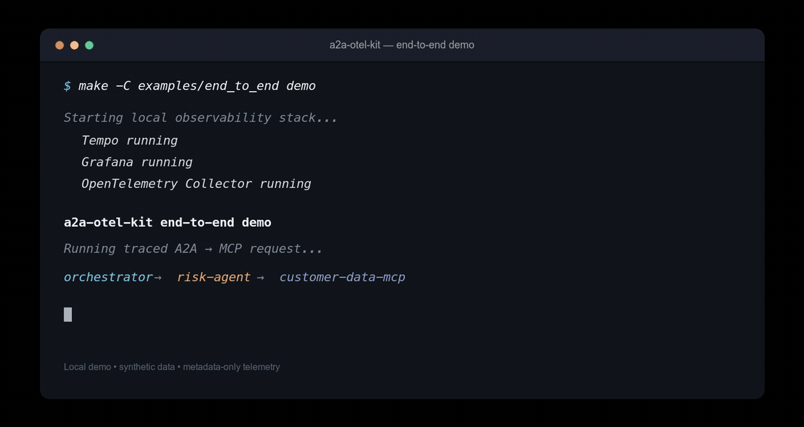
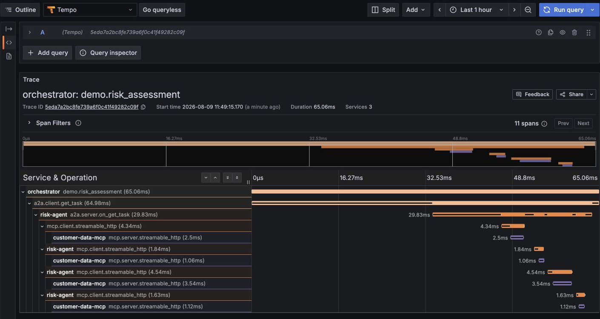

# End-to-end A2A → MCP observability demo

This demo provides executable proof that `a2a-otel-kit` preserves one distributed trace across A2A and MCP service boundaries while keeping business content out of exported telemetry.

## What this demo proves

The demo provides executable evidence that:

- W3C Trace Context survives an A2A client/server boundary;
- the same trace continues into MCP Streamable HTTP;
- client and server spans remain correlated across three services;
- the OpenTelemetry Collector receives the required A2A and MCP spans before the demo is considered successful;
- telemetry remains metadata-only;
- a private value used by the business flow is intentionally present in the business response and verified to be absent from the exported trace telemetry.

It intentionally does **not** attempt to prove LLM quality, agent reasoning, model performance, or vendor-specific observability capabilities.

## Topology

```text
Orchestrator
    │
    │ A2A JSON-RPC / HTTP
    ▼
Risk Agent
    │
    │ MCP Streamable HTTP
    ▼
Customer Data MCP
    │
    │ OTLP/HTTP
    ▼
OpenTelemetry Collector
    │
    ▼
Tempo
    │
    ▼
Grafana
```

The real trace produced by the demo is expected to contain a hierarchy similar to:

```text
orchestrator
└── demo.risk_assessment
    └── a2a.client.get_task
        └── risk-agent / a2a.server.on_get_task
            ├── mcp.client.streamable_http
            │   └── customer-data-mcp / mcp.server.streamable_http
            ├── mcp.client.streamable_http
            │   └── customer-data-mcp / mcp.server.streamable_http
            └── ...
```

Multiple MCP spans are expected because a real MCP session performs protocol operations in addition to the business tool call.

## Requirements

- Docker with Docker Compose
- `uv`
- a supported Python version for the repository
- project dependencies installed

From the repository root:

```bash
uv sync --frozen --all-groups
```

## Quick run

From the repository root:

```bash
make -C examples/end_to_end demo
```

That command:

1. starts OpenTelemetry Collector, Tempo, and Grafana;
2. runs the local A2A and MCP services;
3. executes the traced business request;
4. waits until the Collector positively receives the required spans;
5. verifies trace continuity and privacy;
6. leaves the observability stack running so the trace can be inspected in Grafana.

Expected final output:

```text
Demo execution: PASSED
...
Demo verification: PASSED
```

### 20-second walkthrough

The recording shows the demo starting, verification passing, and the complete trace tree in Grafana Tempo:

<p align="center">
  
</p>

## Run step by step

Start the observability stack:

```bash
make -C examples/end_to_end demo-up
```

Run the request:

```bash
make -C examples/end_to_end demo-run
```

Verify the exported trace:

```bash
make -C examples/end_to_end demo-verify
```

Open Grafana:

```text
http://localhost:3000
```

Then use **Explore → Tempo** and search for the latest trace ID:

```bash
cat .demo-receipts/last_trace_id.txt
```

Stop the observability stack:

```bash
make -C examples/end_to_end demo-down
```

## Real trace

A real trace captured from the demo is stored in the repository at:

```text
docs/assets/demo/trace.png
```

<p align="center">
  
</p>

In the recorded execution:

- **3 services** participated in the same distributed trace;
- the trace contained **11 spans**;
- A2A client/server propagation was preserved;
- MCP Streamable HTTP continued the same trace;
- the private business identifier did not appear in the exported telemetry.

## Business flow

The business scenario is deliberately simple:

```text
Orchestrator
    │
    │ get task / risk assessment
    ▼
Risk Agent
    │
    │ get_customer_risk_score(customer_id)
    ▼
Customer Data MCP
    │
    └── risk_score = 32
```

The business response intentionally contains a private identifier so the demo can prove that telemetry remains content-free.

Example business output:

```text
A2A task result: customer-private-123-risk-32
```

The verifier then checks that `customer-private-123` does not appear in the exported trace representation.

## Verification contract

The demo is successful only if all of the following conditions are true:

```text
✓ a2a.client.get_task exists
✓ a2a.server.on_get_task exists
✓ mcp.client.streamable_http exists
✓ mcp.server.streamable_http exists
✓ required spans share the same trace_id
✓ private business identifier is absent from trace telemetry
```

This is stronger than checking endpoint reachability or a successful exporter flush.

## Why the runner waits for Collector receipt

The services use normal OpenTelemetry batching behavior. A process can finish its business work before every span has been exported.

The demo therefore keeps the A2A and MCP services alive until the Collector receipt contains every required span for the current trace.

```text
business request completes
        │
        ▼
keep child services alive
        │
        ▼
wait for Collector receipt
        │
        ├── A2A client
        ├── A2A server
        ├── MCP client
        └── MCP server
        │
        ▼
positive proof
        │
        ▼
stop child services
```

A fixed `sleep()` is intentionally not used as the synchronization contract.

## Fresh run

If you want a clean local trace history before recording a screenshot or GIF:

```bash
make -C examples/end_to_end demo-reset
```

This stops the stack before removing `.demo-receipts`, then starts it again.

Do not truncate `.demo-receipts/traces.jsonl` while the Collector is running.

## Capture material for the README or LinkedIn

Recommended sequence:

```bash
make -C examples/end_to_end demo-reset
make -C examples/end_to_end demo
```

Capture:

1. the final terminal output with `Demo verification: PASSED`;
2. Grafana **Explore → Tempo** showing the complete trace tree;
3. the shared Trace ID.

For a short silent GIF or video, show:

```text
run demo
   ↓
verification PASSED
   ↓
open Grafana
   ↓
expand A2A → MCP trace
```

No audio is required.

## Troubleshooting

### Grafana does not show the trace

First confirm that the verifier passes:

```bash
make -C examples/end_to_end demo-verify
```

Then confirm the latest trace ID:

```bash
cat .demo-receipts/last_trace_id.txt
```

If verification passes but Grafana cannot find the trace, the issue is specifically in the Collector → Tempo → Grafana path, not in A2A/MCP context propagation.

### Demo waits for required spans and times out

Inspect the Collector receipt:

```bash
TRACE_ID=$(cat .demo-receipts/last_trace_id.txt)

grep "$TRACE_ID" .demo-receipts/traces.jsonl
```

List observed span names:

```bash
grep -o '"name":"[^"]*"' .demo-receipts/traces.jsonl | sort -u
```

### Ports already in use

The demo uses:

```text
3000  Grafana
3200  Tempo
4318  OTLP/HTTP Collector
8101  Risk Agent
8102  Customer Data MCP
```

Stop conflicting local services or update the demo configuration consistently.

## Cleanup

Stop containers:

```bash
make -C examples/end_to_end demo-down
```

Remove local receipts:

```bash
make -C examples/end_to_end demo-clean
```

## Scope

The demo deliberately does not include:

- a real LLM;
- LangGraph;
- Redis;
- a database;
- OAuth;
- Kubernetes;
- a cloud provider;
- `verifiable-ai-governance`.

Those would add unrelated failure modes without strengthening the core proof.

The demo answers one question:

> **Can `a2a-otel-kit` preserve one distributed trace across A2A and MCP while keeping business content out of telemetry?**

The executable verification is designed to answer **yes** only when the exported evidence supports that claim.
